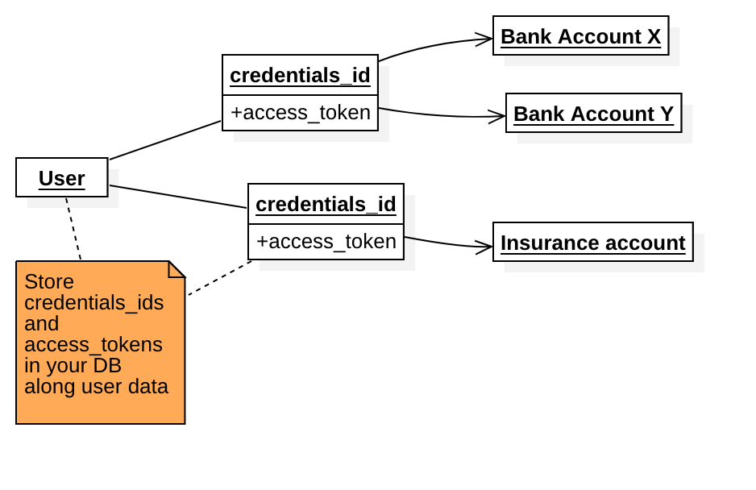
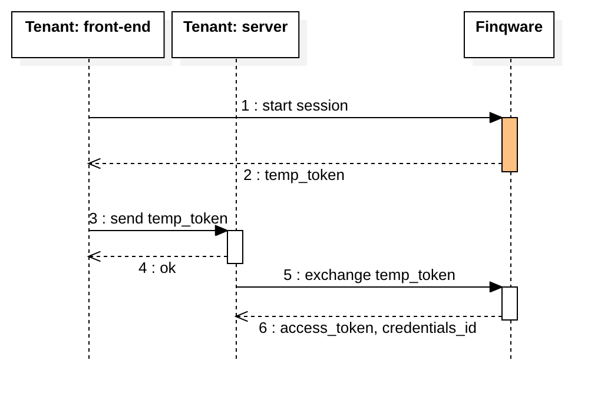
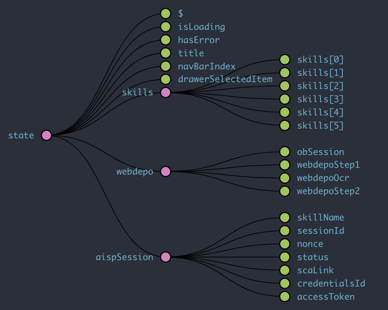
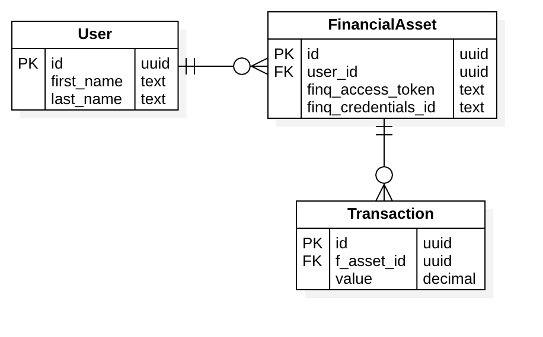

# Quick start

Welcome to the [Finqware](https://www.finqware.com) API!

This alpha phase is about learning and testing various Open Banking APIs.

1. [Register](https://www.finqware.com/joinalpha) yourself (personal or company) as a `servicer`
2. Register a tenant app with your servicer and get your API keys
3. Go through the skills catalog and check what you want to implement
4. Write the code, use the sandbox mode for each _skill_ for test & dev

# Overview

## Skills

### Concept

Open Banking is about _opening_ access for businesses to create value on top of financial services provided via APIs.

Each API that we integrate into our middleware is a `skill`. Examples: an account information API from Bank X is a skill, a payment initiation service from Bank Y is another skill.

With the initial releases, we'll focus on three skill types: account information, payment initiation and marketplace. As a roadmap item we're planning to introduce more utility such as _customer care_ and skills related to _resource management_.

Each skill comes in two flavors: production and sandbox. Test & dev tenants will use sandbox skills.

### Account information

These skills are mainly based on PSD2 AISP APIs from various banks.

Use cases: wallet applications or enterprise systems that need to query for bank accounts and transaction reports.

### Payment initiation

Initially based on PSD2 PISP APIs from various banks.

Use cases: merchants willing to accept payments through a direct account-to-account transfer bypassing classic payment schemes.

### Marketplace

Based on custom connectors that we're building with our partner servicers.

Use cases: marketplaces interested in selling financial products without the hassle of a direct integration with banks, insurance providers etc.

## Servicers

A `servicer` is a partner company registered with Finqware.

It may be a bank or an insurance company providing skills into the middleware, or a fintech that consumes the Finqware API.

Or even both: a bank may be providing its own APIs into the middleware and at the same time it may implement a multi-banking experience on top of Finqware.

From a Finqware API consumer standpoint, a servicer may register multiple `tenant` apps.

A servicer has a number of developers/users with credentials on our developer's portal.

## Tenants

A `tenant` is your software, consuming the Finqware API. It usually has two components:

- a client-side application (eg: a mobile and/or a web front-end)
- a server. This is where you run the business logic, the user database etc.

It's important to make a clear distinction between the two. There are specific data items (i.e. tokens, secrets) that you can safely store in your client app, and others that we recommend to be used only in a server-to-Finqware communication.

A servicer may register multiple tenant apps for different business cases or just for technical reasons (eg: test & prod apps).

For a granular access control and reporting, each tenant is required to register the list of skills it connects to.

## Security model

The Finqware API is protected by a number of keys and tokens.

It is important to follow the best practice around where it's safe to store/use them. You can make an API call from a web application using the `client_id`, but use an `access_token` only from your server-side code. Currently, a generally accepted opinion among security experts is that you cannot safely store secrets in a client application.

| Token/key      | Client | Description                                                 |
| -------------- | ------ | ----------------------------------------------------------- |
| client_id      | yes    | An identifier for a tenant app                              |
| client_secret  | no     | A secret generated for each tenant app                      |
| client_app_key | yes    | Used to initate a user [session](#user-onboarding)          |
| temp_token     | yes    | A temporary token that can be exchanged for an access_token |
| access_token   | no     | A permanent token authorizing access to user data           |
| credentials_id | no     | Points to user data (eg: a bank account, an insurance)      |

### Tenant-level elements

Each tenant application will have three security elements associated with it:

- client_id
- client_secret
- client_app_key

They do not expire, but can be refreshed using the developer's portal.

As you'll notice in the developer's [guide](#guide), a user session ends with receiving a `temp_token`. The reason we're not sending the `access_token` directly is that we designed the session flow to be developed entirely in a web/mobile context. This choice also facilitates the future development of client SDKs. Hence the middleware returns a temporary token that needs to be sent to your backend first and then exchanged for the final `access_token` via a server-to-Finqware API call.

As a side note: we're also considering introducing a callback endpoint as an option. Following the end of a session, Finqware would call an API endpoint provided by your server for the token exchange.

### User-level elements

Taking a user through a [session](#user-onboarding) is about obtaining consent to access their data (eg: an existing bank account), or creating new value for that user (eg: selling a new insurance). In both cases, there is at least one target object created at the middleware level.

Finqware does not store data that identifies the owner, but we return a `credentials_id` that represents your acccess point to these objects.

Practical example: for an account information skill backed by PSD2 AISP, a user may give their consent to access three bank accounts. In this case, your generated `credentials_id` will point to these three objects.

An API call where `credentials_id` is specified, needs to be authorized by its respective `acccess_token`.

Your user may have multiple pairs of [`credentials_id`, `access_token`] depending on how many resources they decide to access through your app. Plan and design your user database considering this aspect.



# Guide

This section is for [tenant](#tenants) app developers who want to implement the base API (REST & GraphQL). We'll also make SDK's available, but the API endpoints will always remain open for those who need maximum flexibility.

Implementing Finqware [skills](#skills) is always centered around the **end-user** - that being the individual or institution who owns the data queried through the middleware. As a [tenant](#tenants) app developer, you're implementing two aspects:

1. A conversational UX that takes the user through a number of action steps in order to get access to the data. This is a web or native-mobile UI that takes your user through an onboarding experience.

2. A Backend/server piece that consumes data the user has already consented for in the previous step.

## User onboarding

The first thing to focus on is to offer your user a smooth onboarding experience. You may design a classic wizard with a step-by-step approach or have a more inovative approach like chatbot or voice-based UIs.

The [Sessions API](#sessions-api) helps you implement such a UI. A session is very similar to what most of us know from web programming: an ordered sequence of steps that share the same state. Although this is a unified developer experience, each skill may have particular steps to implement.

Practical examples:

- getting the user consent for an account information skill is a one-step session (i.e. trigger the strong customer authentication process)
- selling a bank deposit product takes the user through multiple steps where the user may be required to submit information and upload data in separate steps due to inter-step dependencies.

As we integrate more skills into the middleware, we'll be documenting the required steps for each case. The Sessions API is generic enough to support complex conversational UIs that involve multiple iterations, uploads, synchronous and asynchronous communication (eg: cases where the online session might be interrupted due to an offline verification).

This diagram is an example of a three-step session, where the first two steps have attachments (uploads).


**A session is essentially a conversation where each message may include attachments.**

### Detailed flow

An oboarding session is triggered by a `HTTP POST` to the `/sessions` endpoint. It has to include three elements:

- `client_id`: identifies your tenant application
- `client_app_key`: authorizes the call (safe to be used from a client app)
- `skill`: which skill you're starting the onboarding session for. This is taken from the skills catalog published and updated on our docs.

```json
{
  "client_id": "{{client_id}}",
  "client_app_key": "{{client_app_key}}",
  "skill": "xyz_aisp_sbx_#1.0"
}
```

Following a successfull call, you will receive a message including:

- a `session_id`: identifies the newly created session. You will use this to submit subsequent steps.
- a `nonce`: a temporary token safe to be used from a client app. You will use this to submit data in the next iteration - that would be step #1 into your session. Currently the nonce expires in 30 minutes.
- a `status`: an informative message

```json
{
  "nonce": "F3YXJlCjAwMTZpZGVudGlmaWVyIG5vbmNlcwowMDJlY2lkIHRpbWU8MjAxOS0wNS0zMVQwOToxNToxNS41OTE5Nz",
  "session_id": "7489fe74-a91d-4897-8895-cd5e05c0fc4b",
  "status": "SESSION_CREATED"
}
```

Now that the session is created, you can start submitting data specific to each skill. At each iteration you specify the `step` and provide the `nonce` retrieved from the previous one. In a multi-step session, at each step submission, the response message will include a `step_id` and the `nonce` for the next step.

Use the `/sessions/{session_id}/steps` endpoint to submit data for a specific step.

```json
{
  "client_id": "{{client_id}}",
  "nonce": "{{nonce}}",
  "skill": "xyz_sbx_#3.0",
  "step": "product_form",
  "data": {
    "value": "100000",
    "currency": "EUR",
    "period": "12"
  }
}
```

At certain steps, a skill might require specific uploads. An example would be an onboarding session for a credit card product. The KYC (know your customer) flow asks for personal data, ID upload and photo/selfies.

Use the `/steps/{step_id}/upload` endpoint to submit uploads for a specific step.


In the above diagram please notice the moments where `nonce` for each step and the `temp_token` are generated.
The nonce to be used for any API call related to step #1 is generated when the session is initialized. The nonce to be used for any API call related to step #2 is generated when step #1 data is submitted.

The [temp_token](#security-model) is generated when you submit data with the last step - in the example above, the session has two steps, hence it's generated with Step #2. This marks the end of a successful user session: user consent has been given or the product onboarding was done without any issue.

This is an important point in this flow, as you need to make the switch to the server-side. The switch is made by sending the `temp_token` to your backend server. This is where you call the `/token` endpoint to exchange it for an `access_token` along with the `credentials_id` that points to the newly created object/s.



The call to `/token` is authenticated by using the `client_id` and `client_secret`. The `access_token` plus the `credentials_id` need to be stored by your backend along with the end-user data.

## Consuming data

Having the `access_token` and the `credentials_id` for a certain resource generated with the flow above, you can now start querying the data.

This is specific for each skill. An account information skill would be used by querying the `/accounts` and `/transactions` API endpoints. We're also planning to release the GrapqhQL endpoints, including support for realtime subscriptions - currently in internal testing phase.

At this stage, all the API calls should be done by your tenant's backend, authenticated with the tenant's `client_id` and `client_secret`.

## Designing a tenant app

As mentioned before, building an application on top of Finqware means **in general** that you have to build a front-end (web/mobile) and a backend. It is unsafe to build a client-only app unless it will run on trusted devices.

It will be possible to build your app entirely on the backend though. This is targeted to enterprise applications.

### The front-end

The challenge here is to design how to keep state between [Session](#user-onboarding) steps. State management in web/mobile apps has become a hot topic, especially since Facebook introduced the [flux](https://facebook.github.io/flux/) pattern back in 2014. It's always a matter of taste and depends greatly on what programming language and framework you're using.

The diagram below is a screenshot of a [Redux](https://redux.js.org/) store used in our demo mobile app. The app, which we'll open source, is actually written with [Flutter](https://flutter.dev/) and uses a port of Redux in [Dart](https://dart.dev/).
In the example below, the client app has a central Redux state where we keep parameters related to the GUI (eg: `isLoading`) and pervasive data such as what we need for session/steps.



A 1st-level branch stores a list of [skills](#skills) queried using the Catalog API. The other 1st-level branches are actual objects that store session/step data: `webdepo` is a bank deposit product and `aispSession` holds data for any skill based on PSD2 AISP.

### The backend

A super simple UML design for your database potentially looks like this:



In the example above: an end-user would give you access to multiple financial assets by completing onboarding session/s. Each asset has a pointer to the respective Finqware resource in the form of the pair [`finq_credentials_id`, `finq_access_token`]. It also has a number of transactions associated - if the asset is for example a credit card.

# Catalog API

# Sessions API

# Accounts API

# Transactions API
