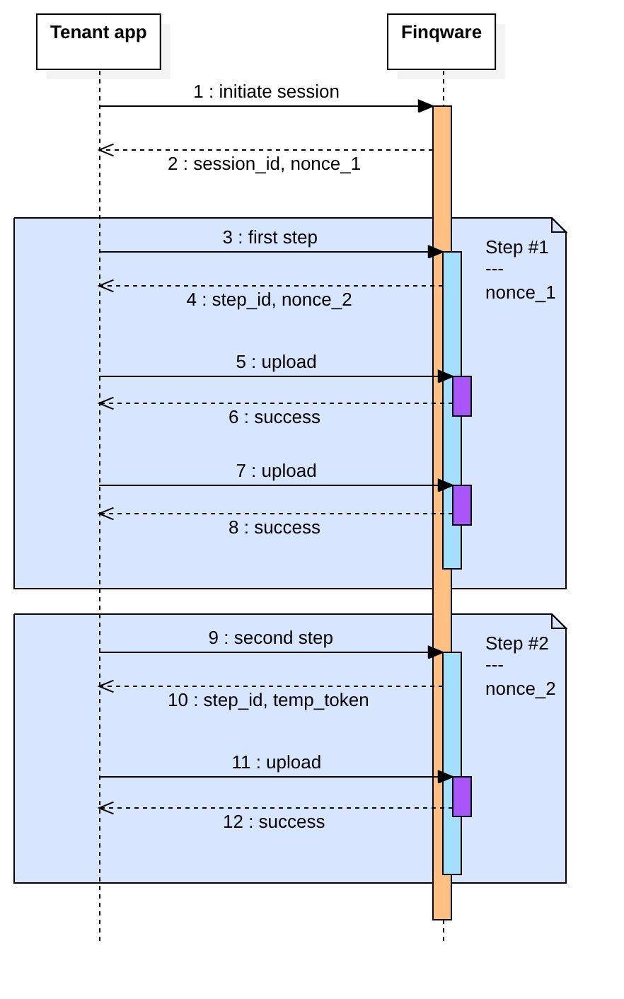

# Quick start

Welcome to the [Finqware](https://www.finqware.com) API!

This alpha phase is about learning and testing various Open Banking APIs.

1. [Register](https://www.finqware.com/joinalpha) yourself (personal or company) as a `servicer`
2. Register a tenant app with your servicer and get your API keys
3. Go through the skills catalog and check what you want to implement
4. Write the code, use the sandbox mode for each _skill_ for test & dev

# Overview

## Skills

### Concept

Open Banking is about _opening_ access for businesses to create value on top of financial services provided via APIs.

Each API that we integrate into our middleware is a `skill`. Examples: an account information API from Bank X is a skill, a payment initiation service from Bank Y is another skill.

With the initial releases, we'll focus on three skill types: account information, payment initiation and marketplace. As a roadmap item we're planning to introduce more utility such as _customer care_ and skills related to _resource management_.

Each skill comes in two flavors: production and sandbox. Test & dev tenants will use sandbox skills.

### Account information

These skills are mainly based on PSD2 AISP APIs from various banks.

Use cases: wallet applications or enterprise systems that need to query for bank accounts and transaction reports.

### Payment initiation

Based on PSD2 PISP APIs from various banks.

Use cases: merchants willing to accept payments through a direct account-to-account transfer bypassing classic payment schemes.

### Marketplace

Based on custom connectors that we're building with our partner servicers.

Use cases: marketplaces interested in selling financial products without the hassle of a direct integration with banks, insurance providers etc.

## Servicers

A `servicer` is a partner company registered with Finqware.

It may be a bank or an insurance company providing skills into the middleware, or a fintech that consumes the Finqware API.

Or even both: a bank may be providing its own APIs into the middleware and at the same time it may implement a multi-banking experience on top of Finqware.

From a Finqware API consumer standpoint, a servicer may register multiple `tenant` apps.

A servicer has a number of developers/users with credentials on our developer's portal.

## Tenants

A `tenant` is your software, consuming the Finqware API. It usually has two components:

- a client-side application (eg: a mobile and/or a web front-end)
- a server. This is where you run the business logic, the user database etc.

It's important to make a clear distinction between the two. There are specific data items (i.e. tokens, secrets) that you can safely store in your client app, and others that we recommend to be used only in a server-to-Finqware communication.

A servicer may register multiple tenant apps for different business cases or just for technical reasons (eg: test & prod apps).

For a granular access control and reporting, each tenant is required to register the list of skills it connects to.

## Security model

[//]: # "imagine in text  "
[//]: # "imagine in dreapta >  "

# Guide

This section is for [tenant](#tenants) app developers who want to implement the base API (REST & GraphQL). As a roadmap item, we'll provide open source SDKs to simplify this process.

Implementing Finqware [skills](#skills) is always centered around the **end-user** - the individual or institution who owns the data queried through the middleware. As a [tenant](#tenants) app developer, you're implementing two aspects:

1. A conversational UX that takes the user through a number of action steps in order to get access to the data. This is a web or native-mobile UI that takes your user through an onboarding experience.

2. A Backend/server piece that consumes data the user has already consented for.

## User onboarding

The first thing to focus on is to offer your user a smooth onboarding experience. It may be a classic wizard with a step-by-step approach or a more inovative approach like chatbot or voice-based UIs.

The [Sessions API](#sessions-api) helps you implement such a UI. A session is very similar to what most of us know from web programming: an ordered sequence of steps that share the same state. Although this is a unified developer experience, each skill may have particular steps to implement.

Practical examples:

- getting the user consent for an account information skill is a one-step session (i.e. trigger the strong customer authentication process)
- selling a bank deposit product takes the user through multiple steps where the user may be required to submit information and upload data in separate steps due to inter-step dependencies.

As we integrate more skills into the middleware, we'll be documenting the required steps for each case. The Sessions API is generic enough to support complex conversational UIs that involve multiple iterations, uploads, synchronous and asynchronous communication (eg: cases where the online session might be interrupted due to an offline verification).

This diagram is an example of a three-step session, where the first two steps have attachments (uploads).


**A session is essentially a conversation where each message may include attachments.**

### Detailed flow

An oboarding session is triggered by a `HTTP POST` to the `/sessions` endpoint. It has to include three elements:

- `client_id`: identifies your tenant application
- `client_app_key`: authorizes the call (safe to be used from a client app)
- `skill`: which skill you're starting the onboarding session for. This is taken from the skills catalog published and updated on our docs.

```json
{
  "client_id": "{{client_id}}",
  "client_app_key": "{{client_app_key}}",
  "skill": "xyz_aisp_sbx_#1.0"
}
```

Following a successfull call, you will receive a message including:

- a `session_id`: identifies the newly created session. You will use this to submit subsequent steps.
- a `nonce`: a temporary token safe to be used from a client app. You will use this to submit data in the next iteration - that would be step #1 into your session. Currently the nonce expires in 30 minutes.
- a `status`: an informative message

```json
{
  "nonce": "F3YXJlCjAwMTZpZGVudGlmaWVyIG5vbmNlcwowMDJlY2lkIHRpbWU8MjAxOS0wNS0zMVQwOToxNToxNS41OTE5Nz",
  "session_id": "7489fe74-a91d-4897-8895-cd5e05c0fc4b",
  "status": "SESSION_CREATED"
}
```

Now that the session is created, you can start submitting data specific to each skill. At each iteration you specify the `step` and provide the `nonce` retrieved from the previous one. In a multi-step session, at each step submission, the response message will include a `step_id` and the `nonce` for the next step.

Use the `/sessions/{session_id}/steps` endpoint to submit data for a specific step.

```json
{
  "client_id": "{{client_id}}",
  "nonce": "{{nonce}}",
  "skill": "xyz_sbx_#3.0",
  "step": "product_form",
  "data": {
    "value": "100000",
    "currency": "EUR",
    "period": "12"
  }
}
```

At each step, a skill might require specific uploads. An example would be an onboarding session for a credit card product. The KYC (know your customer) flow asks for personal data, ID upload and photo/selfies.

Use the `/steps/{step_id}/upload` endpoint to submit uploads for a specific step.



###

# Catalog API

# Sessions API

# AISP APIs

# Marketplace APIs
